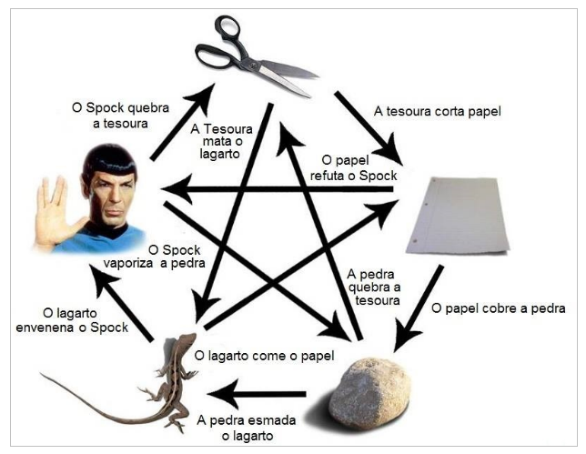

# Desafio JokenPo

  

### Entradas de jogadas: 
- PAPEL
- PEDRA 
- TESOURA
- LAGARTO
- SPOCK

### Endpoints:

- (GET) Cadastrar jogador e jogada: 
    - /jogador/{numeroJogador}/jogada/{ferramenta}
- (GET) Listar jogadores e jogadas:
    - /jogadores
- (DELETE) Deletar um jogador
    - jogador/{numeroJogador}
- (GET) Limpar lista de jogadores 
    - /novoJogo
- (GET) Jogar
    - /jogar

#### Regras 

    • Não utilizar banco de dados.
    • Não utilizar bibliotecas utilitárias externas.

A implementação da vitoria, visto a possibilidade de ter mais de 2 jogdores e todos vencerem um ao outro, foi feita da seguinte forma (Exemplo):  
Entrada 5 jogadores  
Processo de vitoria:
Verifica os 2 primeiros, o vencedor concorre com o terceiro, e assim sucessivamente.

---
#### Referência

[Doc. Referencia](Desafio1.docx)